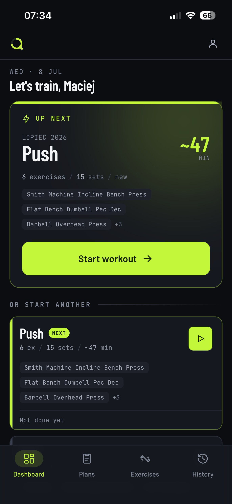
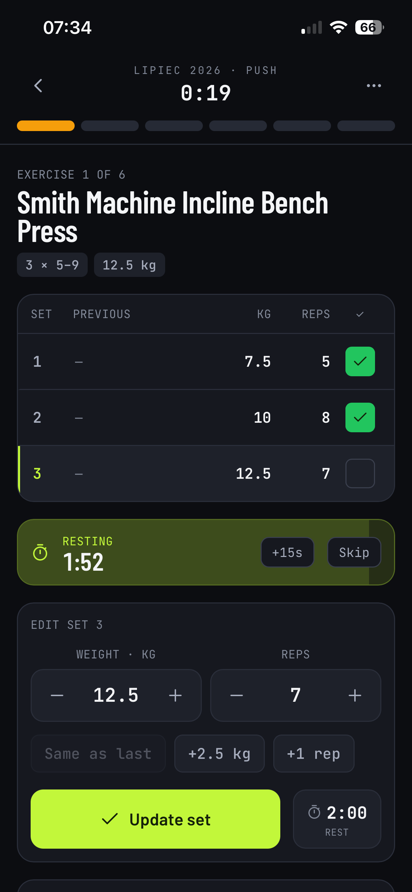
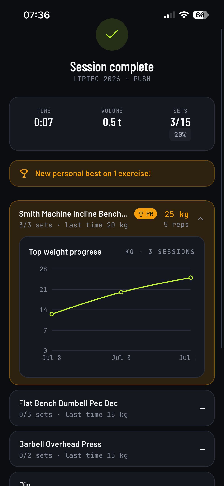
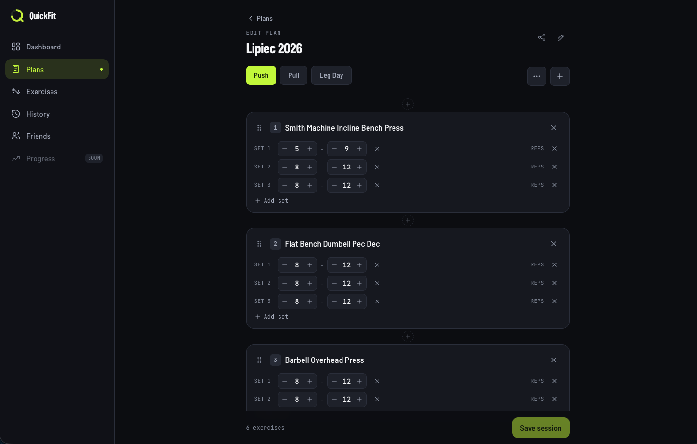

<div align="center">


# QuickFit

The training tracker that replaces my Google Sheets.

<!-- ─────────────  TECH STACK BRICKS  ───────────── -->

**Backend**


**Infrastructure**


**Frontend**


</div>

---

## Overview

QuickFit is a web app I built because I was sick of the Google Sheets mess I'd made for myself. It's a self-hosted workout tracker for planning training, logging sessions, sharing plans with others, and (soon) Google Health integration.

The project was mainly built as an exercise to learn new technologies and practices - not just to ship a tracker, but to build it "properly" end to end: real auth, a real deployment story, a real CI/CD pipeline.

**Overall**:

- **Kubernetes deployment** - how often do you get to build a K8s app from the ground up? `k3s` in prod (Traefik ingress, local-path storage), `minikube` locally, both driven from the same Kustomize `base` + `overlays/{local,prod}` so environments stay in sync instead of drifting.
- **Docker** - every push builds, lints, tests, and (on a tag) pushes images to `ghcr.io` and rolls out to prod automatically.
- **OpenAPI** - the frontend never hand-writes API types or calls. Orval generates TanStack Query hooks straight from the backend's OpenAPI spec, so the two stay in sync for free. Love this approach 😇
- **Taskfile** - my Makefile replacement; every dev/lint/test/deploy command in one place (`task dev`, `task lint`, `task test-backend`, `task k8s-local`, ...).

**Kubernetes**:

- **Two clusters, one set of manifests** - `k3s` on a DigitalOcean cluster for prod, `minikube` locally for testing, both built from the same `k8s/base` and diverging only through Kustomize overlays (ingress class, image tag, replica count, resources).
- **Postgres in-cluster** - a `StatefulSet` + PVC (`local-path`) instead of a managed database, specifically to get hands-on with StatefulSets, PVCs, and a headless service — the kind of thing a managed DB would have hidden from me.
- **CI/CD-driven rollout** - GitHub Actions builds and pushes images on every push, then on a tag push: applies k8s secrets from GitHub Secrets, runs Alembic migrations as a one-off `Job`, patches the image tag with `kustomize edit set image`, and waits on the rollout.
- **Secrets** - plain k8s `Secret`s created from GitHub Secrets in the pipeline (or from a local untracked `.env` for `minikube`) — simplest option that's still safe enough at this scale.

**Backend:**

- **FastAPI** - used to learn dependency injection, JWT auth, `structlog`, and a resource-first project layout (`auth/`, `plan/`, `exercise/`, ... each owning its own router/schema/service) based on [zhanymkanov/fastapi-best-practices](https://github.com/zhanymkanov/fastapi-best-practices), rather than the classic layered `routers/`, `schemas/`, `services/` split.
- **SQLAlchemy, Pydantic, Alembic** - standard async SQL stack for models, validation, and migrations.
- **OpenAPI** - the spec is generated straight from the SQLAlchemy models and Pydantic schemas, no hand-written spec to keep in sync.
- **Auth** - JWT access + refresh tokens in httpOnly cookies (stateless access token, stateful/revocable refresh token) plus Google OAuth 2.0 login.
- **Docker Compose** - spins up a real Postgres for integration tests instead of mocking the database.
- **Ruff** - my favorite Python linter and formatter.
- **uv** - package manager, used here as an experiment.

**Frontend**:

- **React, TypeScript, Tailwind** - established, boring-in-a-good-way frontend stack.
- **UI** - designed and implemented with the help of Claude Code (I'm no designer at all).
- **TanStack Query** - paired with Orval-generated hooks to make backend integration simple and clean; also my favorite way to handle auth state and API calls without writing much boilerplate.
- **Vite** - dev server and build tool.
- **Responsive** - one codebase for mobile (logging workouts at the gym) and desktop (building plans at a bigger screen) — see the screenshots below.

## Features

- Exercise library
- Training plan builder (sessions, sets, reps, rest periods, ...)
- Workout logging, including in-progress sessions you can pick back up and finish later
- Share a plan with another user; they log their own progress against it, and (soon) you can see how they're doing
- Set a default plan per user, whether it's your own or one shared with you

**Incoming:**

- Progress analytics (volume per muscle group, PRs, exercise history over time)
- Google Health / Fitbit integration (read recovery metrics, write completed sessions)

## Screenshots

| Dashboard | Logging a session | Session complete |
|---|---|---|
|  |  |  |

**Plan builder (desktop)**



## Project Structure

```text
quickfit/
├── api/            # FastAPI backend, resource-first structure (auth/, plan/, exercise/, ...)
│   ├── src/
│   ├── alembic/    # DB migrations
│   └── tests/
├── frontend/       # React + TypeScript + Vite + Tailwind
│   └── src/
├── k8s/
│   ├── base/       # shared manifests (deployments, services, ingress, postgres)
│   └── overlays/   # local (minikube) and prod (k3s) patches
├── context/        # planning docs (auth, k8s, product context)
└── Taskfile.yml    # dev/lint/test/deploy commands
```

## Roadmap

- [ ] Progress analytics
- [ ] Google Health / Fitbit integration

## License
MIT — see [LICENSE](LICENSE).
